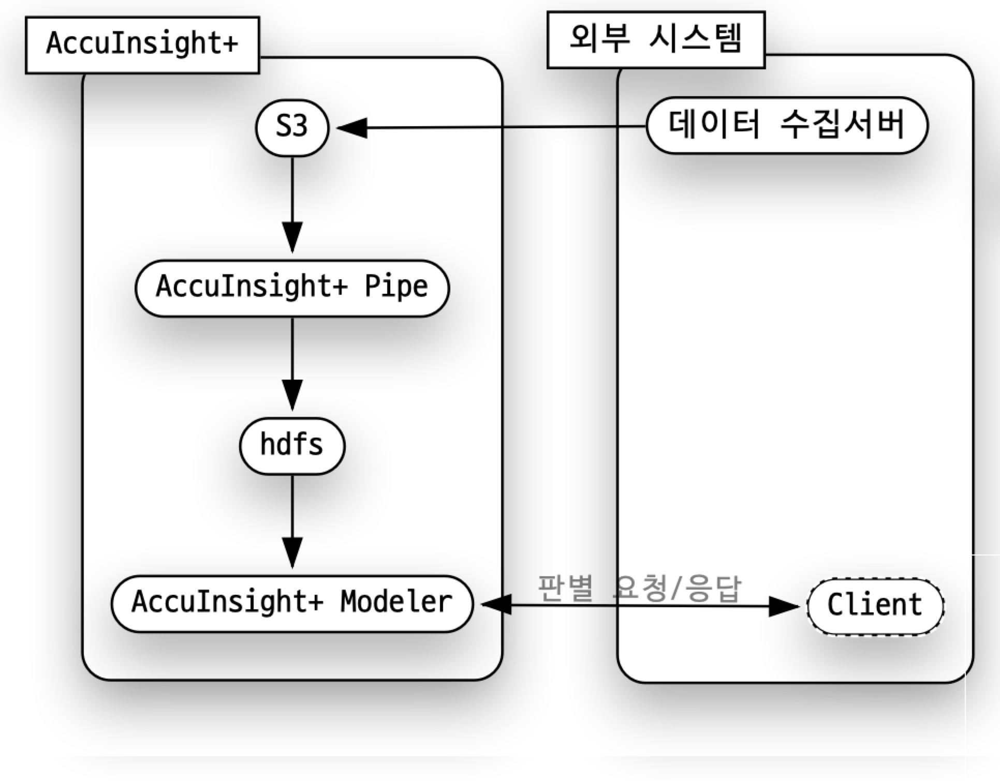

# System 구성

# 데이터 설명
* 입금, 출금, 대출, 지불, 송금등의 거래에서 이행행위에 대한 데이터
## Column Desc
|컬럼명           | 설명                                                                    |Type |
|-----------------|-------------------------------------------------------------------------|-----|
|type             | 지불 방식(1 : CASH IN, 2: CASH OUT, 3 :DEBIT, 4 : PAYMENT, 5 : TRANSFER)|International -범주형|
|amount           | 거래금액                                                                |Decimal|
|nameOrig         | 송금회원                                                                |String|
|oldbalanceOrig   | 송금회원_거래전 잔고                                                    |Decimal|
|newbalanceOrig   | 송금회원_거래후 잔고                                                    |Decimal|
|nameDest         | 수취회원                                                                |String|
|oldbalanceDest   | 수취회원_거래전 잔고                                                    |Decimal|
|newbalanceDest   | 수취회원_거래후 잔고                                                    |Decimal|
|isFraud          | 사기거래 여부                                                           |Int-범주형|

# 분석 시나리오
* 외부 시스템에서 S3에 데이터를 계속 저장하고 있다.
* AccuInsight+ Pipe를 통해 S3에 저장된 데이터를 전처리 한다.
* AccuInsight+ Pipe에서 전처리한 데이터는 hdfs에 저장한다.
                     (EDA에서는 S3사용 혹은 PC에 다운로드)
* AccuInsight+ Modeler를 통해 이상행위 판별 모델을 생성한다.
* AccuInsight+ Modeler에 RestFul 웹서비스로 FDS의 이상행위 탐지 모델을 구현한다.
* Asset화 하여 향후 타부서 사용할 수 있게 한다.
* 단, 외부 시스템(데이터 수집서버, Client)등은 구현하지 않는다.

# 1.EDA
* [1.EDA로 이동](./1.EDA/README.md)

# 2.Load And Preprocessing
* [2.LoadAndPreprocessing로 이동](./2.LoadAndPreprocessing/README.md)

# 3.Modeling
* [3.Modeling로 이동](./3.Modeling/README.md)

# 4.Asset
* [4.Asset로 이동](./4.Asset/README.md)
